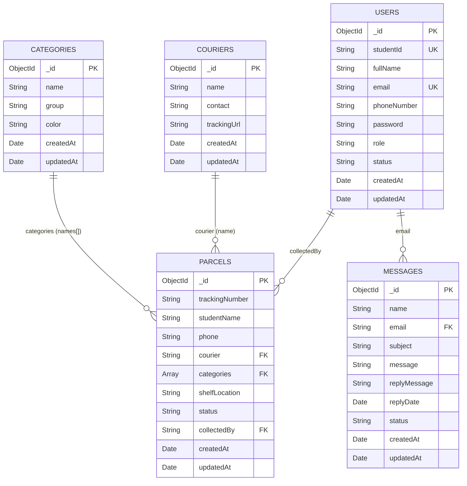

# JasHub Parcel Tracking System — Data Dictionary

**Database**: MongoDB Atlas  
**Database Name**: `parcelsystem`  
**Total Collections**: 5

---

## 1. `users` Collection

Stores registered user/admin accounts.

| # | Field Name   | Data Type  | Required | Constraints / Notes                        | Description                        | Example                          |
|---|-------------|------------|----------|--------------------------------------------|------------------------------------|----------------------------------|
| 1 | `_id`       | ObjectId   | Auto     | Primary key, auto-generated by MongoDB     | Unique document identifier         | `ObjectId("65a1b2c3d4...")` |
| 2 | `studentId` | String     | Yes      | Unique                                      | Student's ID number                | `"SW01234"`                  |
| 3 | `fullName`  | String     | Yes      | —                                           | Full name of the user              | `"Ahmad bin Ali"`            |
| 4 | `email`     | String     | Yes      | Unique; validated with regex                | User's email address               | `"ahmad@example.com"`        |
| 5 | `phoneNumber` | String   | Yes      | —                                           | Contact phone number               | `"012-3456789"`              |
| 6 | `password`  | String     | Yes      | Hashed with bcrypt (salt rounds: 12)        | Hashed password                    | `"$2a$12$..."`               |
| 7 | `role`      | String     | Yes      | Default: `"student"`. Values: `student`, `admin` | User role for access control  | `"student"`                  |
| 8 | `status`    | String     | No       | Default: `"active"` (set via admin create)  | Account status                     | `"active"`                   |
| 9 | `createdAt` | Date       | Yes      | Auto-set on registration                    | Account creation timestamp         | `2026-01-15T08:30:00Z`      |
| 10| `updatedAt` | Date       | No       | Auto-set on admin update                    | Last profile update timestamp      | `2026-02-01T10:00:00Z`      |

---

## 2. `parcels` Collection

Stores all parcel records managed by the system.

| # | Field Name       | Data Type      | Required | Constraints / Notes                                   | Description                              | Example                        |
|---|-----------------|----------------|----------|-------------------------------------------------------|------------------------------------------|--------------------------------|
| 1 | `_id`           | ObjectId       | Auto     | Primary key, auto-generated                            | Unique document identifier               | `ObjectId("65b2c3d4e5...")`|
| 2 | `trackingNumber`| String         | Yes      | Used for parcel search (case-insensitive)              | Courier tracking number                  | `"JT1234567890"`           |
| 3 | `studentName`   | String         | Yes      | —                                                      | Name of the parcel recipient             | `"Ahmad bin Ali"`          |
| 4 | `phone`         | String         | No       | —                                                      | Recipient's phone number                 | `"012-3456789"`            |
| 5 | `courier`       | String         | Yes      | Value from `couriers` collection name                  | Courier service name                     | `"J&T Express"`            |
| 6 | `categories`    | Array\<String\>| No       | Values from `categories` collection names              | Tags for weight, month, and parcel type  | `["1kg", "January", "General"]`|
| 7 | `shelfLocation` | String         | No       | —                                                      | Physical shelf/rack location             | `"A-12"`                   |
| 8 | `status`        | String         | Yes      | Default: `"Received"`. Values: `Received`, `Collected` | Current parcel status                    | `"Received"`               |
| 9 | `collectedBy`   | String/ObjectId| No       | References `users._id`; set when parcel is collected   | ID of the user who collected the parcel  | `"65a1b2c3d4..."`         |
| 10| `createdAt`     | Date           | Yes      | Auto-set on creation                                   | Parcel received timestamp                | `2026-01-20T14:00:00Z`    |
| 11| `updatedAt`     | Date           | Yes      | Auto-set on creation and every update                  | Last modification timestamp              | `2026-01-25T09:30:00Z`    |

### Computed Fields (not stored, calculated on read via `calculatePrice`)

| Field            | Type    | Description                                             | Example     |
|------------------|---------|---------------------------------------------------------|-------------|
| `pricing.basePrice`    | Number  | Base price from weight category (1kg=RM1, 3kg=RM2, 5kg=RM3, >5kg=RM5) | `2`   |
| `pricing.overdueCharge`| Number  | RM20 per month after first 30 days uncollected          | `40`        |
| `pricing.totalPrice`   | Number  | `basePrice + overdueCharge`                             | `42`        |
| `pricing.daysHeld`     | Number  | Days since parcel was received                          | `65`        |
| `pricing.weightCategory` | String | Weight label derived from categories                  | `"3kg"`     |

---

## 3. `categories` Collection

Stores configurable tags/labels used when receiving parcels.

| # | Field Name  | Data Type | Required | Constraints / Notes                                  | Description                     | Example         |
|---|------------|-----------|----------|------------------------------------------------------|---------------------------------|-----------------|
| 1 | `_id`      | ObjectId  | Auto     | Primary key, auto-generated                           | Unique document identifier      | `ObjectId(...)` |
| 2 | `name`     | String    | Yes      | —                                                     | Category display name           | `"1kg"`     |
| 3 | `group`    | String    | Yes      | Values: `Weight`, `Month`, `Parcel Type`              | Grouping for UI display         | `"Weight"`  |
| 4 | `color`    | String    | Yes      | Values: `purple`, `blue`, `orange`                    | UI color theme for the group    | `"purple"`  |
| 5 | `createdAt`| Date      | Yes      | Auto-set on creation                                  | Creation timestamp              | `2026-01-01T00:00:00Z` |
| 6 | `updatedAt`| Date      | Yes      | Auto-set on creation and every update                 | Last update timestamp           | `2026-01-01T00:00:00Z` |

### Default Seeded Values

| Group        | Names                                                                                                  | Color    |
|--------------|-------------------------------------------------------------------------------------------------------|----------|
| Weight       | `1kg`, `3kg`, `5kg`, `Above 5kg`                                                                      | purple   |
| Month        | `January` – `December`                                                                                | blue     |
| Parcel Type  | `Fragile`, `Electronics`, `General`                                                                   | orange   |

---

## 4. `messages` Collection

Stores contact/support messages submitted by users and admin replies.

| # | Field Name     | Data Type | Required | Constraints / Notes                      | Description                          | Example                       |
|---|---------------|-----------|----------|------------------------------------------|--------------------------------------|-------------------------------|
| 1 | `_id`         | ObjectId  | Auto     | Primary key, auto-generated               | Unique document identifier           | `ObjectId(...)`            |
| 2 | `name`        | String    | Yes      | From form body                            | Sender's name                        | `"Ahmad"`                  |
| 3 | `email`       | String    | Yes      | Used to query user-specific messages      | Sender's email                       | `"ahmad@example.com"`     |
| 4 | `subject`     | String    | Yes      | From form body                            | Message subject                      | `"Lost parcel inquiry"`   |
| 5 | `message`     | String    | Yes      | From form body                            | Message content/body                 | `"I cannot find my..."`   |
| 6 | `replyMessage`| String    | No       | Set by admin via reply endpoint           | Admin's reply content                | `"We have checked..."`    |
| 7 | `replyDate`   | Date      | No       | Set when admin replies                    | Timestamp of admin reply             | `2026-02-01T12:00:00Z`    |
| 8 | `status`      | String    | No       | Set to `"Replied"` when admin responds    | Message status                       | `"Replied"`                |
| 9 | `createdAt`   | Date      | Yes      | Auto-set on creation                      | Message submission timestamp         | `2026-01-28T09:00:00Z`    |
| 10| `updatedAt`   | Date      | Yes      | Auto-set on creation                      | Last update timestamp                | `2026-01-28T09:00:00Z`    |

---

## 5. `couriers` Collection

Stores courier/delivery service providers.

| # | Field Name    | Data Type | Required | Constraints / Notes               | Description                       | Example                          |
|---|--------------|-----------|----------|------------------------------------|-----------------------------------|----------------------------------|
| 1 | `_id`        | ObjectId  | Auto     | Primary key, auto-generated        | Unique document identifier        | `ObjectId(...)`               |
| 2 | `name`       | String    | Yes      | Used as reference in `parcels.courier` | Courier company name           | `"J&T Express"`              |
| 3 | `contact`    | String    | No       | —                                  | Courier contact number            | `"1300-80-9000"`             |
| 4 | `trackingUrl`| String    | No       | —                                  | URL for online tracking           | `"https://www.jtexpress.my/tracking/"` |
| 5 | `createdAt`  | Date      | Yes      | Auto-set on creation               | Creation timestamp                | `2026-01-01T00:00:00Z`       |
| 6 | `updatedAt`  | Date      | Yes      | Auto-set on creation and every update | Last update timestamp          | `2026-01-01T00:00:00Z`       |

### Default Seeded Couriers

| Name            | Contact             |
|-----------------|---------------------|
| J&T Express     | 1300-80-9000        |
| Pos Laju        | 1300-300-300        |
| DHL             | 1800-888-388        |
| FedEx           | 1800-88-6363        |
| Ninja Van       | +60 11-1722 5600    |
| Shopee Express  | +603-2777 9222      |
| Lazada Express  | +603-2728 6600      |
| Other           | -                   |

---

## Collection Relationships

